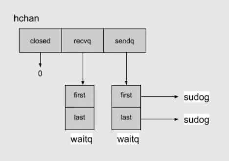
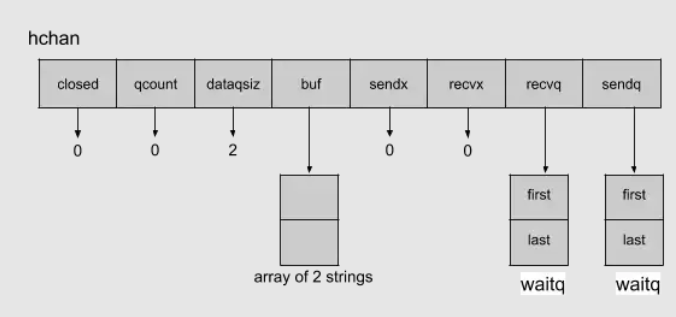

# channel缓冲原理

参考：[[译] Go语言的有缓冲channel和无缓冲channel](https://zhuanlan.zhihu.com/p/101063277) 原网址：[Go: Buffered and Unbuffered Channels](https://medium.com/a-journey-with-go/go-buffered-and-unbuffered-channels-29a107c00268)

无缓冲channel数据结构

有缓冲channel数据结构

