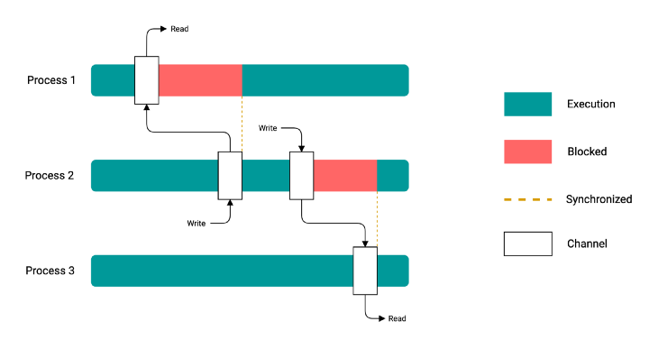
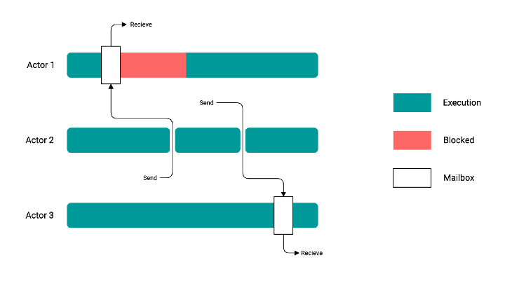

# CSP vs Actor 并发模型

参考资料：

[通信顺序进程](https://zh.wikipedia.org/wiki/%E9%80%9A%E4%BF%A1%E9%A1%BA%E5%BA%8F%E8%BF%9B%E7%A8%8B#cite_note-hoare1978-6)(维基百科), 里面有论文链接（很抽象）

[CSP vs Actor model for concurrency](https://medium.com/@karan99/csp-vs-actor-model-for-concurrency-355a1e2b7e3b)

[Actor模型和CSP模型](https://syxdevcode.github.io/2019/11/22/Actor%E6%A8%A1%E5%9E%8B%E5%92%8CCSP%E6%A8%A1%E5%9E%8B/)

！！！注意参考资料中有些错误。


## 并发机制

+ **多线程**

  基于共享内存的并发机制，后面两种都基于通信而不是共享内存。

  如：Java、C、C++、C#

+ **CSP模型**

  如： Go

+ **Actor模型**

  如：Erlang, Scala, Rust

> 并不是说选用Java就一定没法使用CSP或Actor模型，可以自行按照模型规范实现，也可以使用现有的框架, 比如Java使用Akka Actors实现Actor模型。


## CSP



CSP： Communicating Sequential Process，通信顺序进程。

简单理解就是“不要以共享内存的方式来通信，相反，要通过通信来共享内存”。

在CSP中，使用“信道（Channel）”进行通信和同步。尽管实现了"进程"（这里是广义的概念）之间解耦，但它们仍然与通道耦合。

CSP是完全同步的，通道writer必须阻塞，直到通道reader读取为止。这种基于阻塞的机制的优点是一个通道只需要保存一条消息。它在很多方面也更容易推理。

Go 语言中用 goroutines 和 channels 实现CSP。

**CSP相对于共享内存的并发机制优点**：

对一个共享内存的对象，如果每个都要去修改的话，就必须得记得加锁和解锁，甚至更复杂的操作，而channel则是生产者和消费者，不需要关注锁和共享内存的复杂性（channel本身是线程安全的，内部有加锁），把共享内存看成一份输入和输出的数据。

CSP在Go中应用随处可见, 如：

```go
package main

import (
  "fmt"
  "math/rand"
)

func Consumer(ch <-chan int, result chan<- int) {
    sum := 0
    for i := 0; i < 5; i++ {
        sum += <-ch
    }

    result <- sum
}

func Producer(ch chan<- int) {
    var num int
    for i := 0; i < 5; i++ {
        rand.Seed(20)
        num = rand.Intn(100)
        ch <- num
    }
}

func main() {
    ch := make(chan int)
    result := make(chan int)
    go Producer(ch)
    go Consumer(ch, result)

    fmt.Printf("result: %d\n", <-result)
}
```


## Actor 



由Carl Hewitt于1973年提出，采用的是一切皆为演员的哲学。这类似于某些面向对象编程语言使用的一切都是对象哲学。

Actor模型同样没有共享内存。

它本质上是异步的，消息 sender 不会阻塞无论 reader 是否准备好从"邮箱"中读取消息，而是将消息放入通常称为“邮箱”的队列中。这很方便，但很难解释，而且邮箱可能必须容纳大量消息。

每个“进程”都有一个“邮箱”，消息由 sender 放入 reader 的邮箱，并由 reader 读取。

在 Java 世界中，[Akka](https://akka.io/) 通常用于此。

关于Actor模型详细实现，可以参考[Akka Actors](https://doc.akka.io/docs/akka/current/typed/index.html#actors)源码（不过是Scala实现的）。

> Akka框架是一个分布式高并发框架，基于actor模型开发，为想要使用actor模型的开发人员屏蔽了基本行为处理、actor生命周期管理、异常处理、网络通信等的细节。主要用于开发高并发、高性能、可容错、弹性可扩展的分布式系统。
>
> TODO: Akka 怎么实现高并发、高性能、可容错、弹性可扩展的？
>
> Akka使用场景：
>
> [复杂业务下，我们为何选择 Akka 作为异步通信框架？](https://www.infoq.cn/article/ovjhk48pmk7f*lbw3tkg)


## 对比

+ CSP中的进程是匿名的，而Actor中的进程有身份。
+ CSP使用通道进行消息传递，而Actor使用邮箱。
+ Actor只能通过消息传递进行通信，因此它们是无状态的。
+ CSP消息按照发送的顺序进行传递。
+ Actor模型是为分布式程序设计的，因此它可以跨多台机器进行扩展。
+ Actor之间直接通讯（获取对方的对象找到邮箱放入消息），而CSP是通过Channel通讯，CSP模型比Actor耦合更低。

